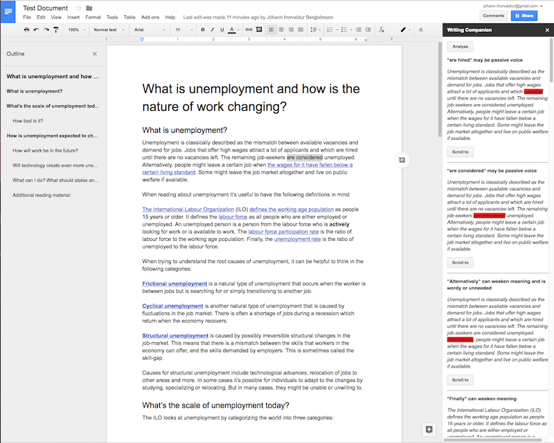

# Google Docs Writing Companion

This is an experiment to see if we can implement a [Hemmingway App](http://www.hemingwayapp.com/) style prose linter as a Google Docs Add On.

The result: *moderately successful*.

There are a lot of limitations on what you can do within a Google Docs Add On. The most severe make it impossible to achieve a great user experience:

  + It's impossible to respond to an edit event so this can never be real-time.
  + It's tricky to highlight errors in the document without losing track of them and leaving the document a mess.

The current approach is therefore a sidebar with an analyze button.

This repo provides scaffolding to extract text from the document, run various analyzers and provide suggestions. Currently it's only using [write-good](https://github.com/btford/write-good) but it's easy to add others.

## How can I help?

Try this out. See if you want something like this. Think of ways to make this nicer. Open PRs. Personally I would like this as either a full real-time app like Hemmingway or as a bot that offers suggestions as other Google Docs users can.

## Development

This is a bit complex and definitely a weird workflow as we're effectively deploying to Google Drive and then into Google Docs.

Create an app with api access in the [Google API Console](https://console.developers.google.com/apis/dashboard). Then create an `.env` file with the following

    export GOOGLE_OAUTH_CLIENT_ID=<your-client-id>
    export GOOGLE_OAUTH_CLIENT_SECRET=<your-client-secret>

Login to your app using Google oAuth to get a personal oAuth token to be able to deploy to Google Drive:

    yarn deploy-token

This will open a oAuth flow in a browser and eventually save authentication tokens to `.tokens.json`.

Then you can deploy to Google Drive using

    yarn deploy

After deploying you will see a new document (script) in your Google Drive called `Writing Companion`. If you open this document you can then publish on a single document by using `Publish -> Test as add-on`.

We've tried to keep most of the logic within the React App so for most part of the development you can simply do

    yarn start

and enjoy all of the hot-reloading goodness instead of having to deploy to Google Drive on every change.

If this proves useful it would be cool to simply publish it as a Google Add On and skip the above mess.
